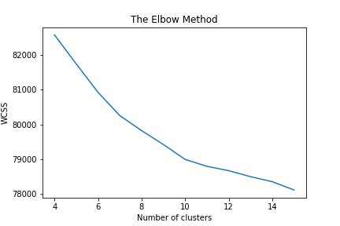

# Project Title

## GS Quantify 2019


## Project structure
├── data\
│   ├── private_test_set.txt\
│   ├── train_set.txt\
│   └── public_test_set.txt\
├── main.ipynb\
├── images\
├── submissions\
├── requirements.txt\
└── License


### Prerequisites

```bash
pip install -r requirements.txt
```

### Usage

#### Description
The problem is identified as a text clustering task. Dataset contains logs occurring with a certain pattern, leading to the formation of clusters

### Approach

In this workbook, I have used Sklearn's TFIDF vectorizer and MiniBatchKmeans to perform some simple document clustering. After which I have ploted the clusters using PCA and TSNE

#### Summary
 
- TF-IDF Vectorization
- PCA
- TSNE
- MiniBatchKmeans
- Elbow method


